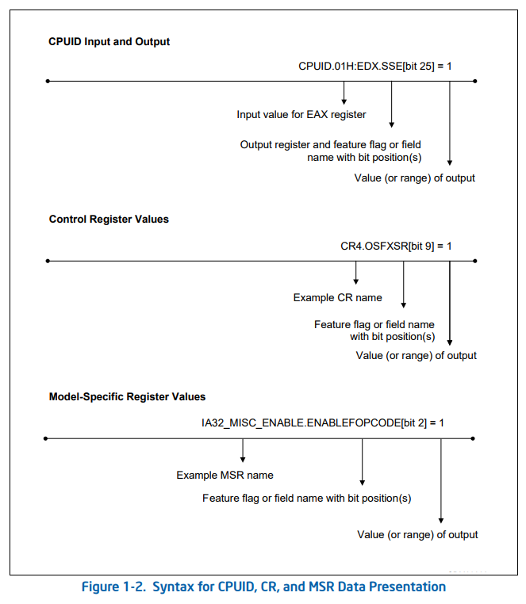

### **Chapter 1 About This Manual**

#### **Summary**

Gives an overview of all five volumes of the Intel® 64 and IA-32 Architectures Software Developer’s Manual. It also describes the notational conventions in these manuals and lists related Intel manuals and documentation of interest to programmers and hardware designers.

#### **Notational Conventions**

**Bit and Byte Order**

Intel 64 and IA-32 processors are “little endian” machines; this means the bytes of a word are numbered starting from the least significant byte.

**Reserved Bits and Software Compatibility**

Instruction operands

```
label: mnemonic argument1, argument2, argument3
```

Hexadecimal numbers: 09FACH (end with **H**)
Binary numbers: 1010B (end with **B**)

Segement addressing
The processor uses byte addressing and also supports segement addressing( example: DS:FF79H and CS:EIP).

CR: control register

MSR: model-specific register

For CPUID, CR, MSR syntax, see here:



Exceptions: an event that typically occurs when an instruction causes an error. Such as divide by zero, page-fault.
